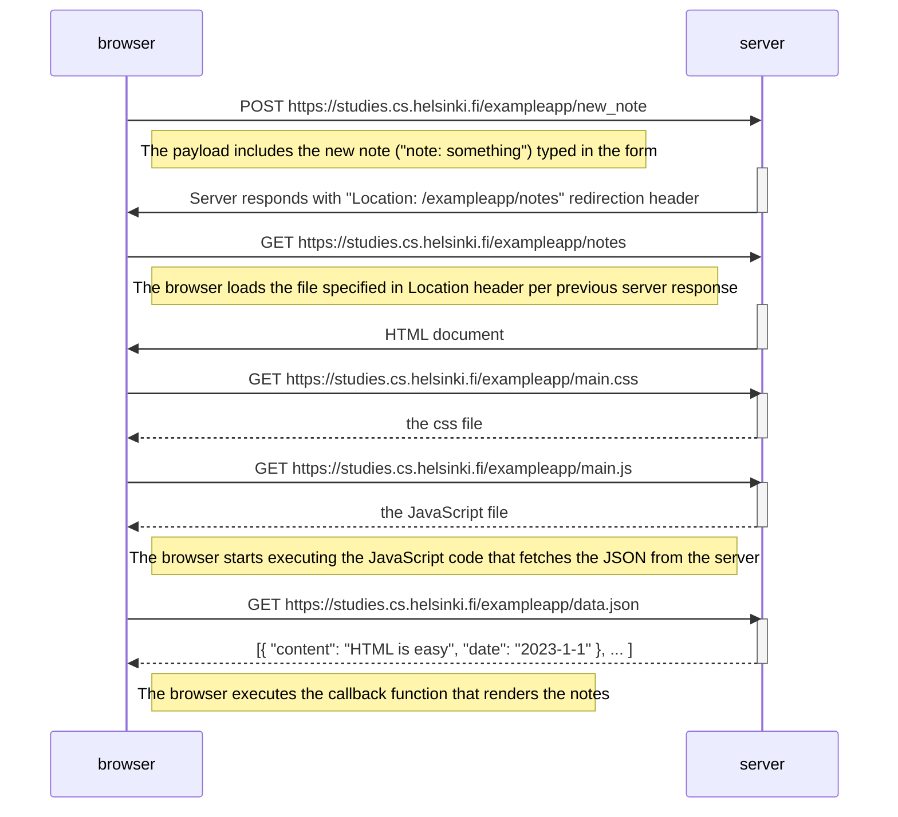

# Exercise 0.4

As seen above, the browser sends the form contents to server, which redirects the browser back to the app's main page "[/exampleapp/notes](https://https://studies.cs.helsinki.fi/exampleapp/notes)". The rest of the diagrams is similar what we've seen in the [example](https://fullstackopen.com/en/part0/fundamentals_of_web_apps#loading-a-page-containing-java-script-review).
