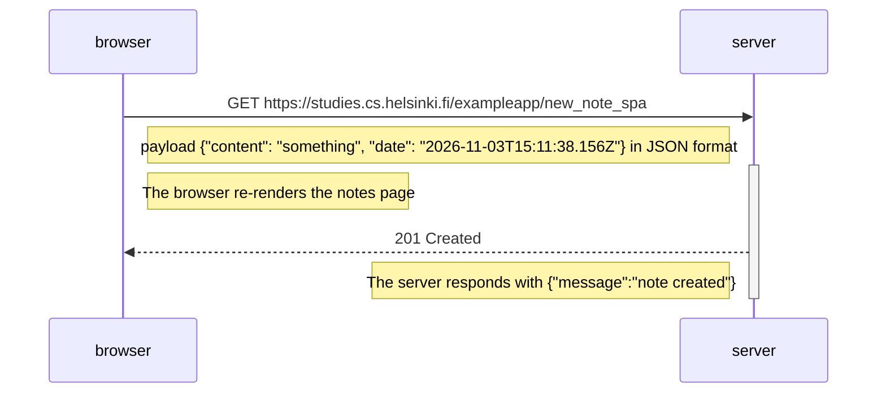

# Exercise 0.6

```mermaid
sequenceDiagram
    participant browser
    participant server

    browser->>server: GET https://studies.cs.helsinki.fi/exampleapp/new_note_spa
    Note right of browser: payload {"content": "something", "date": "2026-11-03T15:11:38.156Z"} in JSON format
    activate server
    Note right of browser: The browser re-renders the notes page
    server-->>browser: 201 Created
    Note left of server: The server responds with {"message":"note created"}
    deactivate server

```
